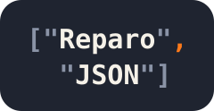

# ReparoJSON

<p align="center">
  
</p>

A simple command-line tool to "repair" JSON. It only fixes the syntactic errors and never formats the given input.


## Usage

```
Usage: reparojson [OPTIONS] [FILE]

Arguments:
  [FILE]  The input JSON file (default: STDIN)

Options:
  -i, --in-place                     Replace the input file in place
  -s, --strict                       Exit with failure if the input JSON is repaired
      --generate-completion <SHELL>  Generate the completion script for the given shell [possible values: bash, elvish, fish, powershell, zsh]
  -v, --version                      Print version
  -h, --help                         Print help
```


## Examples

```
$ echo '[ 1 2 ]' | reparojson
[ 1, 2 ]

$ echo '[ 1, 2, ]' | reparojson
[ 1, 2 ]

$ echo '{ "foo": 1 "bar": 2 }' | reparojson
{ "foo": 1, "bar": 2 }

$ echo '{ "foo": 1, "bar" 2, }' | reparojson
{ "foo": 1, "bar": 2 }
```

See [docs/REPAIR.md](./docs/REPAIR.md) for all what can be repaired, and [docs/GRAMMAR.md](./docs/GRAMMAR.md) for the exact grammar that ReparoJSON accepts.

With `-i`/`--in-place`, the repaired JSON is written back to the input file instead of the output. The file is left untouched if it is already valid or cannot be repaired.

```
$ echo '[ 1 2 ]' > a.json

$ reparojson -i a.json

$ cat a.json
[ 1, 2 ]
```


## Exit Status

ReparoJSON exits with 0 if the input is valid or successfully repaired, and with non-zero otherwise.

With `-s`/`--strict`, it also exits with non-zero if the input is repaired. The repaired JSON is still written to the output.


## Editor Integration Examples

### Neovim v0.11+ with efm-langserver

```lua
vim.lsp.config('efm', {
   cmd = { 'efm-langserver' },
   filetypes = { 'json' },
   init_options = { documentFormatting = true },
   settings = {
      rootMarkers = { ".git/" },
      languages = {
         json = {
            {
               formatCommand = "reparojson",
               formatStdin = true,
            },
         },
      },
   }
})
vim.lsp.enable('efm')
```


## License

See [LICENSE](./LICENSE).
